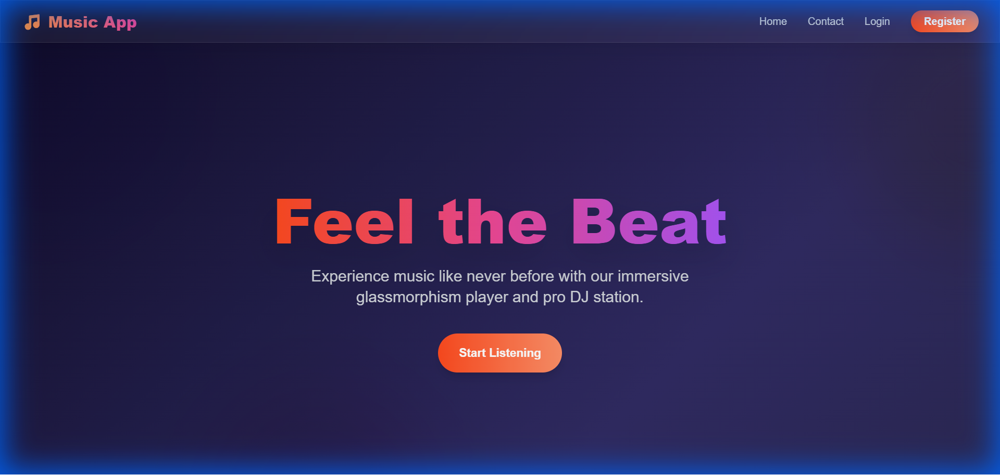
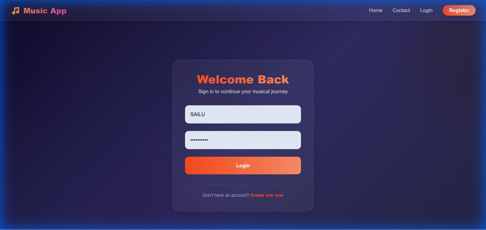
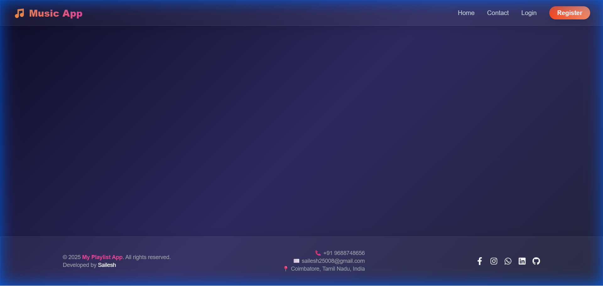

# Music Player with DJ Mixer

A full-stack music player application with advanced DJ mixing capabilities, built with Django and React.

## Features

-   **Music Playback**: Stream and play your favorite tracks.
-   **DJ Mixer**: Professional-grade DJ interface with dual decks, crossfader, and EQ controls.
-   **User Authentication**: Secure login and registration system.
-   **Playlist Management**: Create and manage your personal playlists.
-   **Modern UI**: Sleek, responsive design with a "Sunset Glassmorphism" theme.

## Tech Stack

-   **Frontend**: React, Vite, Tailwind CSS
-   **Backend**: Django, Django REST Framework
-   **Database**: SQLite (default) / PostgreSQL

## Screenshots

### Home Page


### Login Page


### DJ Mixer


## Setup Instructions

### Backend

1.  Navigate to the project root directory.
2.  Install dependencies:
    ```bash
    pip install -r requirements.txt
    ```
3.  Run migrations:
    ```bash
    python manage.py migrate
    ```
4.  Start the server:
    ```bash
    python manage.py runserver
    ```

### Frontend

1.  Navigate to the `frontend` directory.
2.  Install dependencies:
    ```bash
    npm install
    ```
3.  Start the development server:
    ```bash
    npm run dev
    ```

## License

This project is licensed under the MIT License.
